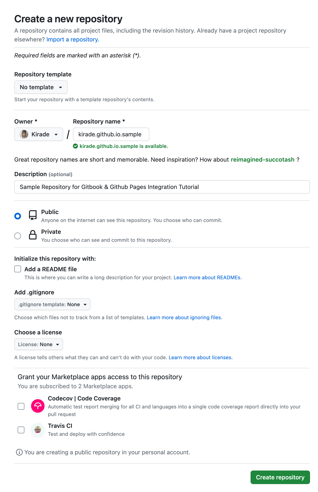

# 튜토리얼

### 0. 준비물&#x20;

튜토리얼 진행을 위해서는 Github, Gitbook 계정이 필요합니다. 만약 기존에 가입된 계정이 없는경우 매끄러운 진행을 위해 가입후 튜토리얼을 진행하는것을 권장드립니다.


### 1. Github 저장소 생성

가장 첫 단계는 Gitbook 의 소스코드를 보관하고 Github Pages 를 호스팅 할 저장소를 만드는 일입니다. Github 에서 저장소를 하나 생성합니다. 저는 `kirade.github.io.sample` 라는 이름으로 만들었습니다.


<figure><figcaption></figcaption></figure>


### 2. Gitbook & Github 저장소 연동

다음으로 Gitbook 에 로그인 하여 블로그의 내용을 관리할 Space 를 신규로 생성합니다. 신규로 생성한 Space 는 앞으로 블로그에 들어갈 컨텐츠를 관리하는 공간입니다.

<figure><figcaption><p>신규로 생성한 Space</p></figcaption></figure>


Space 의 생성이 잘 된것을 확인하였으면, 우측 상단의 메뉴를 클릭하여 `Synchronize with Git` 버튼을 클릭합니다. 이것을 통해 미리 만들어둔 Github 의 저장소와 Gitbook 을 연동하게됩니다.


<div align="center" data-full-width="true">

<figure><figcaption><p>Synchronize with Git</p></figcaption></figure>

</div>


이후 이어지는 선택화면에서 Github 을 선택하고 `Connect with GitHub` 버튼을 눌러 연동을 진행합니다.

<div>

<figure><figcaption><p>Provider</p></figcaption></figure>

 

<figure><figcaption><p>Authentication</p></figcaption></figure>

</div>


연동 이후에는 저장소를 선택하고 상세한 동기화 옵션을 선택할 수 있는 옵션이 표기됩니다.

**Select Repository**

저장소 선택 섹션에서 위에서 생성한 저장소의 정보를 토대로 계정과 저장소를 선택합니다.

**Select Branch**

저장소 선택 이후 아무런 액션을 취하지 않았기 때문에 옵션에 아무런 브랜치가 표기되지 않을 수 있습니다. 옵션 칸에 `master` 를 직접 입력해주면 master 브랜치를 동기화 시점에 생성해줍니다.

**Monorepo, Commit message, Fork Pull-Request Preview**

필수적인 옵션이 아니기 때문에 무시하고 지나갑니다. 옵션의 설명을보고 선택적으로 활용하시면 됩니다.

**Choose priority**

Github 과 Gitbook 사이의 동기화의 우선순위를 정하는 옵션입니다. Gitbook 을 통해서 소스코드를 업데이트하는 작업을 주로 할 예정이기 때문에 `Gitbook to Github` 옵션을 체크해줍니다.


<figure><figcaption></figcaption></figure>


`Synchronize` 버튼을 눌러 동기화를 실행해주면 잠시 후 아래 이미지처럼 동기화 완료 메시지를 확인 할 수 있습니다.

<figure><figcaption></figcaption></figure>


Github 저장소의 소스코드도 함께 확인해보면 소스코드가 정상적으로 동기화 된 것을 볼 수 있습니다.

<figure><figcaption></figcaption></figure>

앞으로 Gitbook 에서 작성한 변경사항은 Github 에 자동으로 동기화가 되게 됩니다.


### 3. Github Workflow 설정

master 브랜치에 자동으로 동기화 되고 있는 소스코드는 Gitbook 에 사용자가 작성한 컨텐츠의 내용만 보관하고 있습니다. 그래서 master 브랜치의 내용을 Github Pages 기능을 통해 렌더링 해도 작성된 내용만 보일 뿐 보기좋은 Gitbook 의 UI 는 함께 렌더링 되지 않습니다.

Gitbook 의 형태를 올바르게 렌더링하기 위해서는 Gitbook 을 빌드하는 과정이 필요합니다. 튜토리얼에서는 빌드 과정을 자동화 하기위해 [이것](https://github.com/marketplace/actions/publish-gitbook)을 활용할 예정입니다.

이 액션은 Gitbook 의 소스코드를 보관하고 있는 master 브랜치로부터 빌드를 진행해서 gh-pages 브랜치에 빌드된 소스코드를 업로드합니다.

빌드 액션을 위한 정의하기 저장소의 설정을 일부 변경해 주어야 합니다. 워크플로우가 최초에 동작할 때 gh-pages 브랜치를 생성하려고 하는데 이 과정에서 쓰기 권한이 필요하기 때문입니다.

저장소의 Settings - Actions - General 에 진입하여 하단의 Workflow permissions 에서 Read and write permissions 에 체크한 뒤 저장합니다.

<figure><figcaption></figcaption></figure>


위의 권한 설정이 진행된 이후  master 브랜치의 `.github/workflows/build.yml` 이라는 파일명으로 아래 코드를 추가합니다. master 브랜치의 push 가 발생하는경우 Gitbook 의 빌드를 수행하는 액션입니다.

```yaml
on:
  push:
    branches:
      - 'master'


jobs:
  build:
    name: Build Gitbook
    runs-on: ubuntu-latest
    steps:
      - name: Checkout
        uses: actions/checkout@v2
      
      - name: Build Gitbook
        uses: tuliren/publish-gitbook@v1.0.1
        with:
          github_token: ${{ secrets.GITHUB_TOKEN }}
```


위의 설정을 완료하고 워크플로우를 확인하면 빌드가 진행되는것을 확인할 수 있습니다.

<figure><figcaption></figcaption></figure>

빌드가 완료 되었다면, 저장소에는 gh-pages 라는 브랜치도 신규로 생성되고 이 브랜치 안에서는 빌드된 소스코드를 확인할 수 있습니다.

<figure><figcaption></figcaption></figure>


### 4. Github Pages 설정

모든 소스코드는 준비되었고 마지막으로 Github Pages 를 설정하는 일만 남았습니다.

저장소의 Settings - Pages 메뉴에서 아래처럼 설정을 진행합니다.

<figure><figcaption></figcaption></figure>


그리고 저장 버튼을 누르면 아래 처럼 사이트가 배포되었다는 문구가 나오게됩니다.

<figure><figcaption></figcaption></figure>

배포된 페이지에 접속하면 Gitbook 에서 작성한 내용이 잘 보여지는것을 확인 할 수 있습니다.

<figure><figcaption></figcaption></figure>


이것으로 Gitbook & Github Pages 를 통해서 블로그를 만드는 작업은 끝났습니다. 앞으로는 Gitbook 을 통해 글을작성하기만하면 자동으로 호스팅중인 Github Pages 에 자동으로 배포가 되게 됩니다.


### 참고

* [튜토리얼을 통해 생성한 저장소](https://github.com/Kirade/kirade.github.io.sample)
* [Github Pages](https://pages.github.com/)
* [Gitbook](https://www.gitbook.com/)
